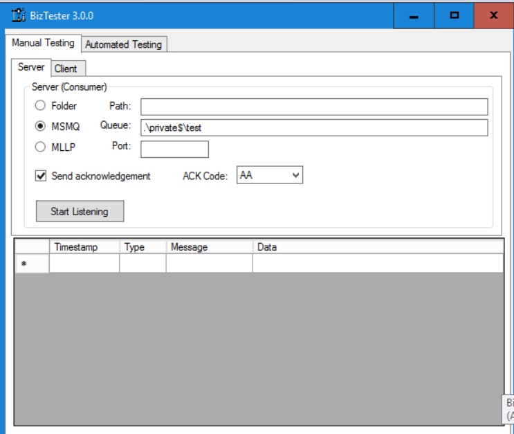
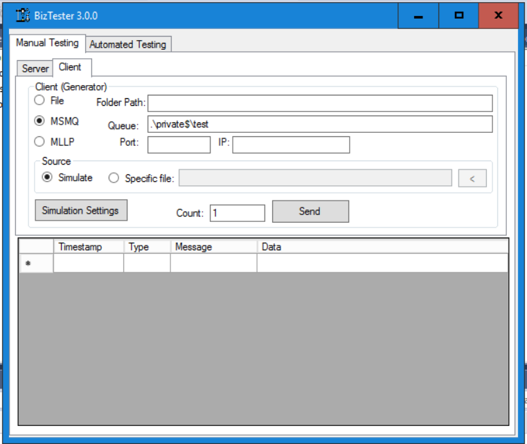

# BiztalkTester

This is a Windows GUI app for testing Biztalk apps.
You can download the installer from <a href="https://github.com/kouroshparsa/BizTester/blob/main/Installer/BizTesterSetup.msi">https://github.com/kouroshparsa/BizTester/blob/main/Installer/BizTesterSetup.msi</a>

# Usage
As shown below, you have the server (listener) settings on the left side and the client (sender) settings on the right side.

Currently, the tool only allows access to localhost meaning that you need to run it on the system where Biztalk is installed and you can set the MLLP host to 127.0.0.1 and for MSMQ you'd create a private queue on localhost.
You have two options for the source:
- Simulate
- Specific file

Simulation automatically generates HL7v2 data based on specifications. You can view and modify the specifications by clicking the "Simulation Settings" button as shown below:

There are a number of dynamic value you can use that are listed below:
| Value    | Description |
| --------- | ------- |
| {now}     | Inserts the current date/time         |
| {random_num}          | Generates a random 6 digit number        |
| {random_first_name}          | Generates a random first name        |
| {random_last_name}          | Generates a random last name        |

# Development
Please feel free to send requests for features or report issues on Github.
If you want to pull the code and modify it, note that this project uses .NET 4.6.1 SDK.
