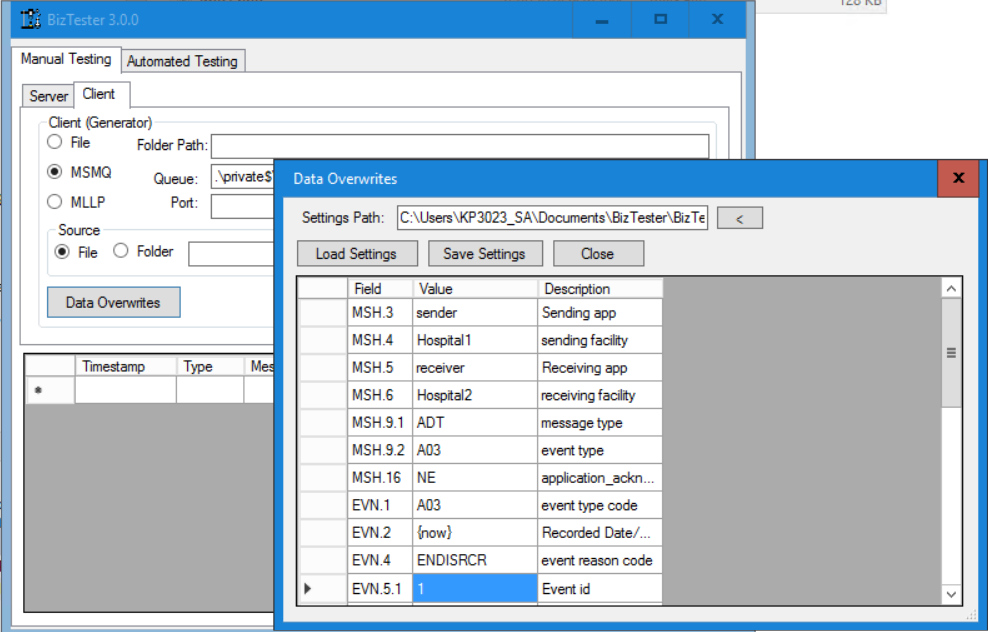

# Introduction

`BizTester` is a Windows GUI app for testing Biztalk apps with HL7v2 messages.
You can download the installer from <a href="https://github.com/kouroshparsa/BizTester/blob/main/Installer/BizTesterSetup.msi">https://github.com/kouroshparsa/BizTester/blob/main/Installer/BizTesterSetup.msi</a>

# Installation

To install, you can grab the installer from the Installer folder of this repository.

# Usage
This tool allows you to receive HL7 (v2 or v3) responses and send HL7v2 messages either from a given file or automatically generate a message to send. 
As shown below, you have the server (listener) settings on the left side and the client (sender) settings on the right side.

As you can see the following protocols are supported:
- File
- MLLP
- MSMQ

The MLLP server has the ability to send back acknowledgement message if the message received indicates that it requires a response (if MSH.15 = 'AL').

`BizTester` also allows you to overwrite field values.
By clicking the "Data Overwrites" button, you can either specify static values or even dynamic values:

There are a number of dynamic values you can use that are listed below:
| Value    | Description |
| --------- | ------- |
| {now}     | Inserts the current date/time         |
| {random_num}          | Generates a random 6 digit number        |
| {random_first_name}          | Generates a random first name        |
| {random_last_name}          | Generates a random last name        |

# Development
Please feel free to send requests for features or report issues on Github.
If you want to pull the code and modify it, note that this project uses .NET 4.6.1 SDK.
