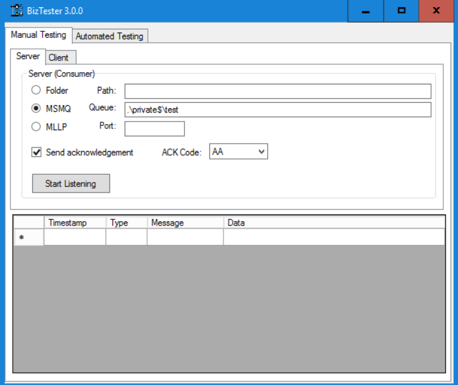
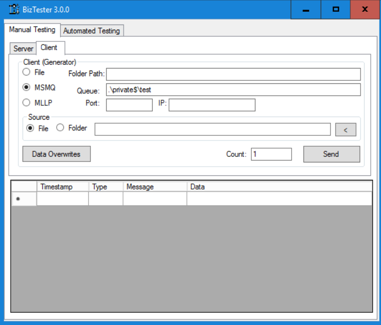

# Introduction

`BizTester` is a Windows GUI app for testing Biztalk apps with HL7v2 messages.


# Installation

To install, you can download the installer from the `Installer` folder of this repository.

# Usage
This tool allows you to send or receive HL7 (v2 or v3) with responses from a given file or automatically generate a message to send. 
As shown below, you have the server (listener) settings on the left side and the client (sender) settings on the right side.



As you can see the following protocols are supported:
- File
- MLLP
- MSMQ

The MLLP server has the ability to send back acknowledgement message if the message received indicates that it requires a response (if MSH.15 = 'AL').

`BizTester` also allows you to overwrite field values.
By clicking the "Data Overwrites" button, you can either specify static values or even dynamic values:


There are a number of dynamic values you can use that are listed below:
| Value    | Description |
| --------- | ------- |
| {now}     | Inserts the current date/time         |
| {random_num}          | Generates a random 6 digit number        |
| {random_first_name}          | Generates a random first name        |
| {random_last_name}          | Generates a random last name        |


# Export / Report

You can export the results by right clicking on the result data grid as shown below and clicking the `Export Data`:


This allows post processing.
Moreover, the `Create Report` option will automatically make a report based on the message id to inform you which messages went through the pipeline and reached the other end and how long it took them as hown below:


# Map Testing

The last tab allows you to test mapping files.


Note that Visual Studio allows you to generate outputs for mapping test messages but you need to do them one at the time and also it does not do comparison to detect regressions.
This tool allows you to alltumatically generate all outputs for as many maps and interfaces as you want and performs xml comparison to detect regressions.

## stetup:
What you need to do is to compile your map and specify the folder that contains your mapping files and specify whether you want to use the Debug or Release dll.
This also assumes that your folder structure is as shown below:
```
MyApp_ORU_BBK.btm
MyApp_ORU_IDM.btm
bin\Debug\MyApp.Maps.dll
bin\Release\MyApp.Maps.dll
tests
|    \__MyApp_ORU_BBK
|                    \__inputs
|                    |        \__ oru_bbk1.xml
|                    |        \__ oru_bbk2.xml
|                    \__ expected_outputs
|                    |                   \__oru_bbk1.xml
|                    |                   \__oru_bbk2.xml
|                    \__ observed_outputs
|                                        \__oru_bbk1.xml
|                                        \__oru_bbk2.xml
 \___MyApp_ORU_IDM
                  \__inputs
                 |         \__ oru_idm1.xml
                 |         \__ oru_idm2.xml
                 \__ expected_outputs
                 |                   \__oru_idm1.xml
                 |                   \__oru_idm2.xml
                 \__ observed_outputs
                                     \__oru_idm1.xml
                                     \__oru_idm2.xml
```

You'd make a folder for each map that you want to test and match the folder name with the map filename without the extension.
Then put your input xml files.
If this is your first set up, you can push the `Generate Expected outputs` to generate output xml files in the outputs folder.
Then you can click on `Run Tests`. This will inspect your dll map file and look at each btm mapping file and load any dependency dll and execute the map to generate the output under the `observered_ouputs` folder and will compare `expected_outputs` with `observed_outputs`.
Note that naturally there will be some values that are always different such as MSH.7 which is a timestamp of the message.
You need to exclude these but specifying them in a `ignore-list.txt` inside each mapping folder (in this example one inside MyApp_ORU_BBK and one inside MyApp_ORU_IDM).
You may copy the xpath from the log message that you'd receive if you try to run the tests that tells you the value of this xpath did not match.
By adding it to the ignore list, you can omit comparison of that value:
```
/ns1:ORU_MyApp_25_GLO_DEF/MSH[1]/MSH.7_DateTimeOfMessage
```

If you have WinMerge installed, you can right click on the failed row and click on "compare side by side" to do a comparison with that tool.


# Creating Regression Reports
The regression report tab allows you to generate a regression report given that you specify 2 hl7 folders. It will parse the hl7 messsages inside these 2 folders and creates parses and compares them based on message id matches and generates a pdf report.


It also identifies missing or new data which can be result of a Biztalk filtering change.


# Development
Please feel free to send feature requests, ask questions or report issues on Github.
If you want to pull the code and modify it, note that this project uses .NET 4.6.1 SDK.
